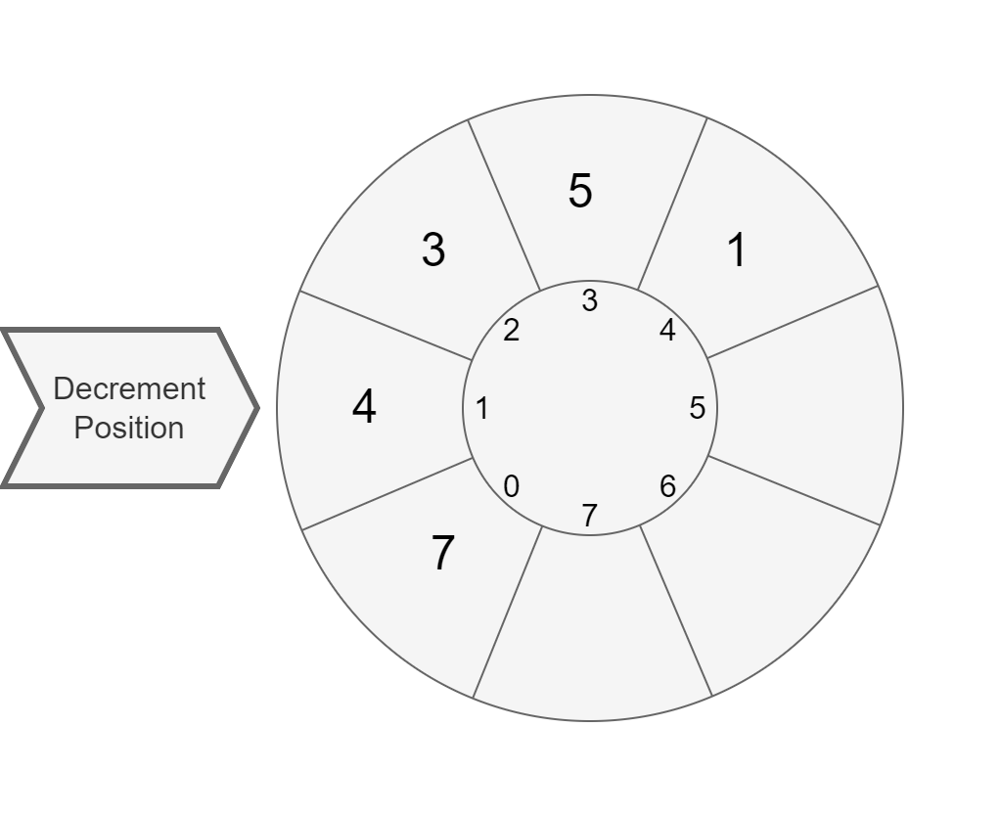

# Decrementing Carousel

The purpose of this exercise is to train you designing simple classes and their relations.

Estimated workload of this exercise is _2h_.

### Description

[`Decrementing Carousel`](src/main/java/com/epam/rd/autotasks/DecrementingCarousel.java) is a container, accepting `int` elements.
`DecrementingCarousel` has a maximum capacity, specified via the constructor.
When created, `DecrementingCarousel` is in accumulating state: you may add elements via the `addElement` method and can produce a [`CarouselRun`](src/main/java/com/epam/rd/autotasks/CarouselRun.java) object via the `run` method.
Once the `run` method is called, `DecrementingCarousel` is in running state: it refuses adding more elements.

The `CarouselRun` allows to iterate over elements of the carousel decrementing them one by one with the `next` method.
The `next` returns the value of the current element:

### Описание

Decrementing Carousel контейнер, принимающий элементы int. DecrementingCarousel имеет максимальную вместимость, указанную в конструкторе. При создании DecrementingCarousel находится в состоянии накопления: вы можете добавлять элементы с помощью метода addElement и создать объект CarouselRun с помощью метода run. После вызова метода run DecrementingCarousel находится в рабочем состоянии: он отказывается добавлять дополнительные элементы.

CarouselRun позволяет перебирать элементы карусели, уменьшая их один за другим с помощью метода next.


Then it decreases the current element by one and switches to the next element:

Данный метод возвращает значение текущего элемента, затем он уменьшает текущий элемент на единицу и переключается на следующий элемент.




The `CarouselRun` iterates over elements in the order of their insertion.  
When an element is decreased to zero, the `CarouselRun` will skip it in further iterations.
When there are no more elements available for decrementing, the `CarouselRun` returns `-1`.

The `CarouselRun` also has the `isFinished` method, which indicates, if the carousel has run out of the lements to decrement.

CarouselRun перебирает элементы в порядке их добавления. Когда элемент уменьшится до нуля, CarouselRun пропустит его в дальнейших итерациях. Когда больше нет элементов, доступных для уменьшения, CarouselRun возвращает -1.

CarouselRun также имеет метод isFinished который указывает, закончились ли в карусели элементы для уменьшения.


### Specification Details
`DecrementingCarousel` has two public methods:
- `boolean addElement(int element)` - adds an element. 
  If element is negative or zero, do not add the element.
  If container is full, do not add the element.
  If the `run` method was called to create a `CarouselRun`, do not add the element.
  If element is added successfully, return `true`. Return `false` otherwise.
- `CarouselRun run()` - returns a `CarouselRun` to iterate over the elements.
  If the `run` method has already been called earlier, it must return `null`:
  `DecrementingCarousel` may generate only one `CarouselRun` object.

`CarouselRun` has two public methods:
- `int next()` - returns the current value of the current element, 
  then decreases the current element by one and switches to the next element in insertion order.
  Skips zero elements. When there is no more elements to decrease, returns `-1`.
- `boolean isFinished()` - when there is no more elements to decrease, returns `true`. Otherwise, returns `false`.

### Детали спецификации

DecrementingCarousel имеет два public метода:

- boolean addElement(int element) – добавляет элемент. Если элемент отрицателен или равен нулю, не добавляет его. Если контейнер заполнен, не добавляет элемент. Если метод run был вызван для создания CarouselRun, не добавляет элемент. Если элемент добавлен успешно, возвращает true. В противном случае – false.
- CarouselRun run() – возвращает CarouselRun для перебора элементов. Если метод run уже был вызван ранее, он должен вернуть null: DecrementingCarousel может генерировать только один объект CarouselRun.

CarouselRun имеет два public метода:

- int next() – возвращает текущее значение текущего элемента, затем уменьшает текущий элемент на единицу и переключается на следующий элемент в порядке добавления. Пропускает нулевые элементы. Когда больше нет элементов для уменьшения, возвращает -1.
- boolean isFinished() – когда больше нет элементов для уменьшения, возвращает true. В противном случае возвращает false.


### Examples

Empty case: Пустой случай
```java
CarouselRun run = new DecrementingCarousel(7).run();
System.out.println(run.isFinished()); //true
System.out.println(run.next()); //-1
```

Regular case: Обычный случай
```java
DecrementingCarousel carousel = new DecrementingCarousel(7);

carousel.addElement(2);
carousel.addElement(3);
carousel.addElement(1);

CarouselRun run = carousel.run();

System.out.println(run.isFinished()); //false

System.out.println(run.next()); //2
System.out.println(run.next()); //3
System.out.println(run.next()); //1

System.out.println(run.next()); //1
System.out.println(run.next()); //2

System.out.println(run.next()); //1

System.out.println(run.isFinished()); //true
System.out.println(run.next()); //-1
```

Refusing adding more elements case: Случай отказа от добавления дополнительных элементов
```java
DecrementingCarousel carousel = new DecrementingCarousel(3);

System.out.println(carousel.addElement(-2)); //false
System.out.println(carousel.addElement(0)); //false
        
System.out.println(carousel.addElement(2)); //true
System.out.println(carousel.addElement(3)); //true
System.out.println(carousel.addElement(1)); //true

//carousel is full
System.out.println(carousel.addElement(2)); //false

CarouselRun run = carousel.run();

System.out.println(run.next()); //2
System.out.println(run.next()); //3
System.out.println(run.next()); //1

System.out.println(run.next()); //1
System.out.println(run.next()); //2

System.out.println(run.next()); //1

System.out.println(run.isFinished()); //true
System.out.println(run.next()); //-1
```

Refusing to add more elements after "run" was called: Отказ от добавления дополнительных элементов после вызова "run"
```java
DecrementingCarousel carousel = new DecrementingCarousel(10);

System.out.println(carousel.addElement(2)); //true
System.out.println(carousel.addElement(3)); //true
System.out.println(carousel.addElement(1)); //true

carousel.run();

System.out.println(carousel.addElement(2)); //false
System.out.println(carousel.addElement(3)); //false
System.out.println(carousel.addElement(1)); //false
```

Refusing to create more than one CarouselRun: Отказ от создания более, чем одного CarouselRun
```java
DecrementingCarousel carousel = new DecrementingCarousel(10);
System.out.println(carousel.run() == null); //false
System.out.println(carousel.run() == null); //true
```
